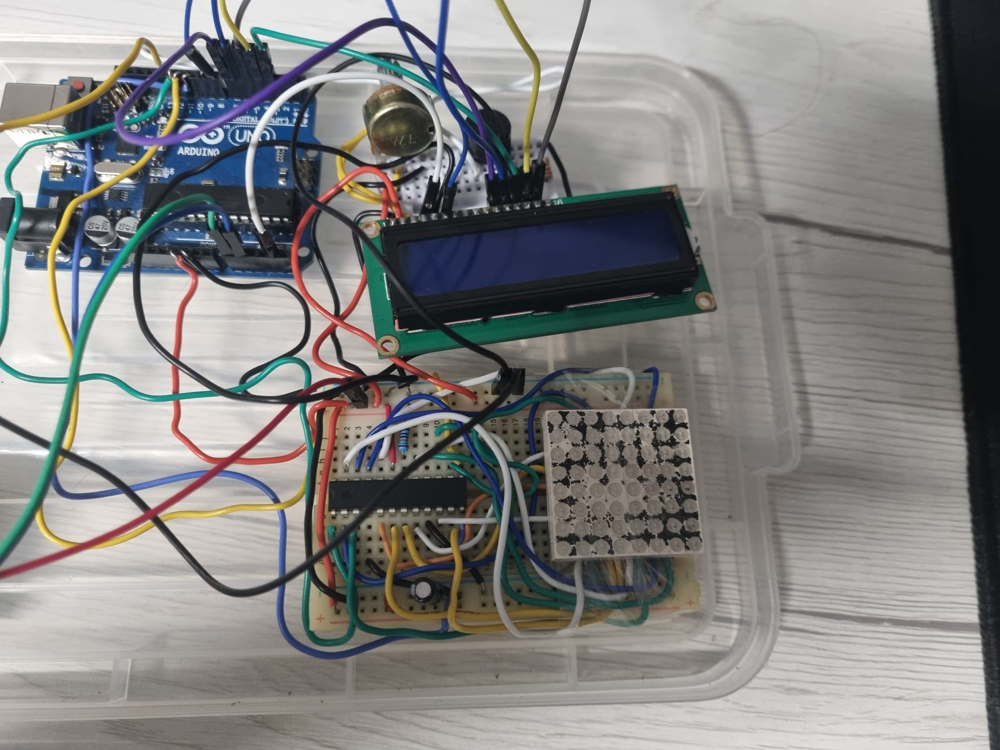
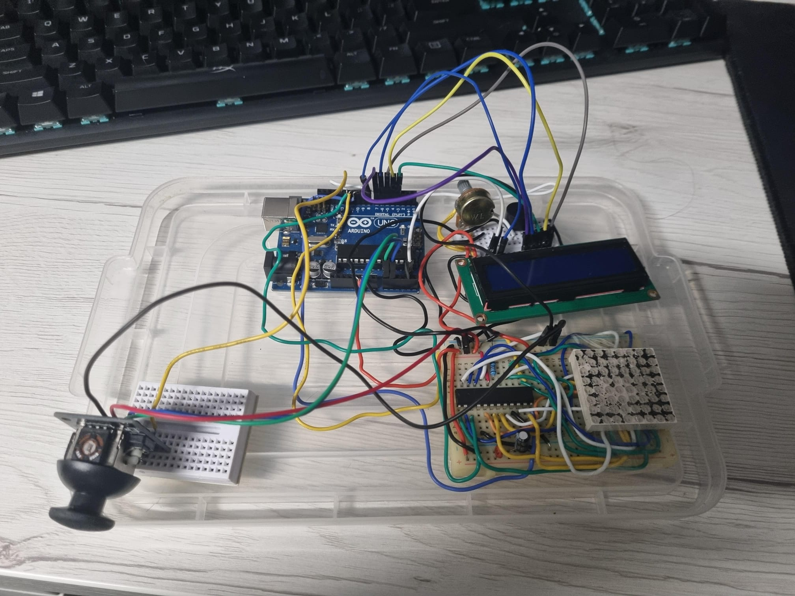

# Robotix-Matrix

##  Components Required
-  Arduino Uno Board
-  Joystick
-  Button
-  8x8 LED Matrix
-  MAX7219•Resistors and capacitors as needed
-  Breadboard and connecting wires
-  LCD Screen 2x16
-  Potentiometer
-  Buzzer
  
## Insipiration
Bomberman video : www.youtube.com/watch?v=2xErEj86Yd8

## Setup

