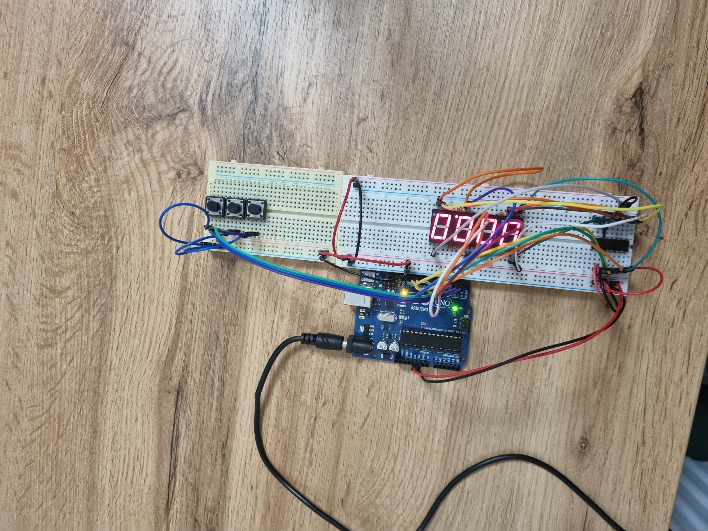

## Commponents
- 1 4x 7-segment display
- 3 buttons
- Resistors and wires as needed

## Requirement
The starting value of the 4 digit 7 segment display shouldbe ”000.0”.  Your buttons should have the following functionalities:
–  Button 1:  Start / pause. 
-  Button 2:  Reset  (if  in  pause  mode).   Reset  saved  laps  (if  in  lapviewing mode).
-  Button 3:  Save lap (if in counting mode), cycle through last savedlaps (up to 4 laps).
## Workflow
1.  Display shows ”000.0”.  When pressing theStartbutton, the timershould start.
2.   During timer counter, each time you press the lap button, you shouldsave  that  timer’s  value  in  memory  (not  persistent,  it  is  OK  to  bedeleted upon reset), up to 4 laps (or more if you want); pressing the5th  time  should  override  the  1st  saved  one.   If  you  press  the  resetbutton while timer works, nothing happens.  If you press the pausebutton, the timer stops.
3.  InPauseMode, the lap flag button doesn’t work anymore.  Pressingthe reset button resets you to 000.0.
4.  After reset, you can now press the flag buttons to cycle through thelap times.  Each time you press the flag button, it takes you to thenext saved lap.  Pressing it continuously should cycle you through itcontinuously.  Pressing the reset button while in this state resets allyour flags and takes the timer back to ”000.0”.

### Be careful:
1.  Make sure you put the dot ”.” on the display to separate the secondsfrom the 10ths of a second
2.  You should display all the digits.  For example,  if you have ”20.4”seconds, you should display ”020.4”.
3.  For  CTI,  interrupts  are  mandatory  for  thesave  lap  and  pausebutton.   This  is  to  increase  precision  of  counting.   For  ComputerScience, these are bonus.

## Setup

## YouTube Link
 [Video](https://www.youtube.com/watch?v=PrA_rYjAwjs)https://www.youtube.com/watch?v=PrA_rYjAwjs
