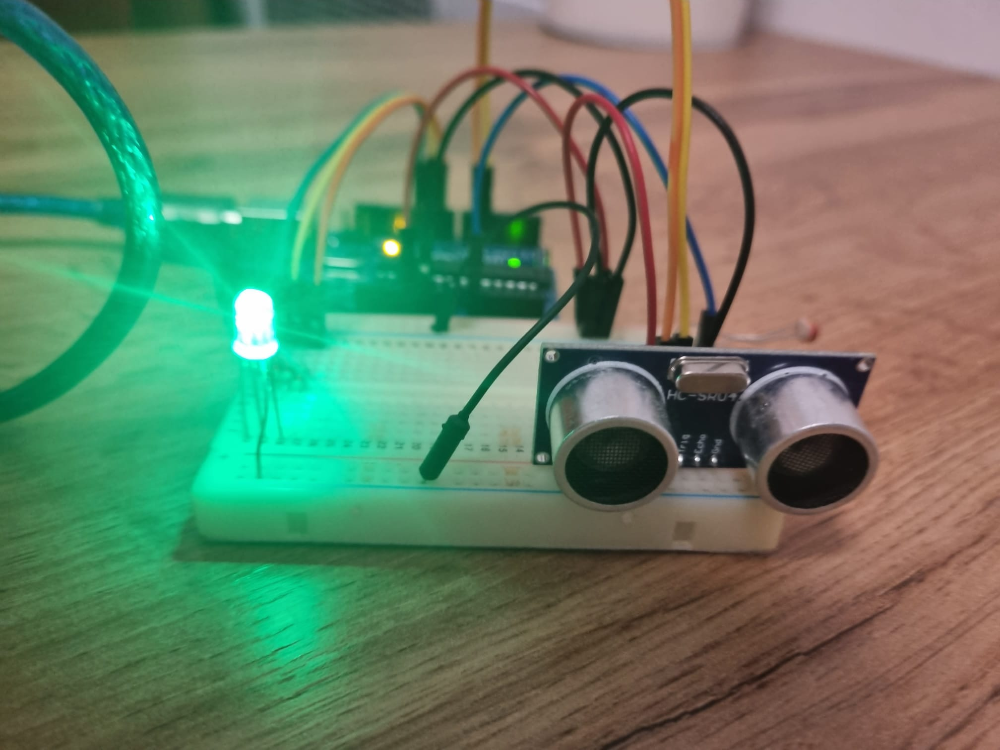
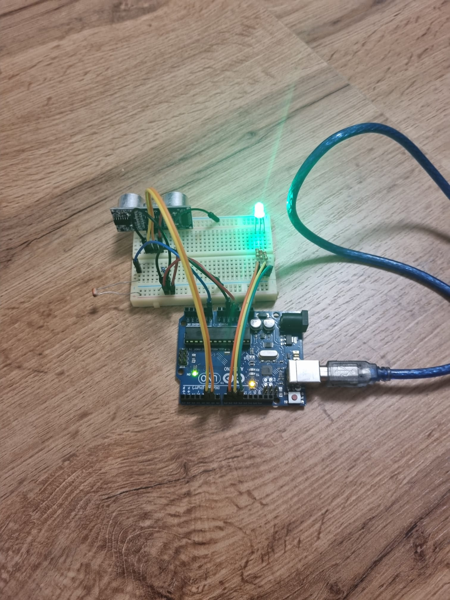
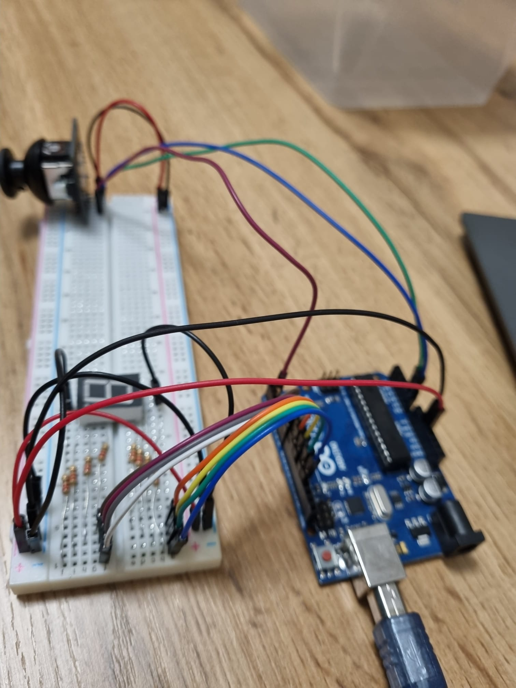

# Elevator Wanna Be

## Commponents
- RGB LEDs (At least 4)
- Buttons (At least 3)
- Buzzer (At least 1)
- Resistors and wires as needed

## Tasks
### Technical Task
Design  a  control  system  that  simulates  a  3-floor  elevator  using  the  Arduinoplatform.  Here are the specific requirements:
- LED Indicators:Each of the 3 LEDs should represent one of the 3 floors.The LED corresponding to the current floor should light up.  Additionally,another LED should represent the elevator’s operational state.  It shouldblink when the elevator is moving and remain static when stationary.
- Buttons:Implement 3 buttons that represent the call buttons from the3 floors.  When pressed, the elevator should simulate movement towardsthe floor after a short interval (2-3 seconds).
- Buzzer  (optional  for  Computer  Science,  mandatory  for  CTI):The buzzer should sound briefly during the following scenarios:
– Elevator arriving at the desired floor (something resembling a ”cling”).
– Elevator  doors  closing  and  movement  (pro  tip:  split  them  into  2different sounds)
- State Change & Timers:If the elevator is already at the desired floor,pressing the button for that floor should have no effect.  Otherwise, aftera button press, the elevator should ”wait for the doors to close” and then”move”  to  the  corresponding  floor.   If  the  elevator  is  in  movement,  itshould either do nothing or it should stack its decision (get to the firstprogrammed floor,  open the doors,  wait,  close them and then go to thenext desired floor).
- Debounce:Remember to implement debounce for the buttons to avoidunintentional repeated button presses.
## Publishing Task
- Add the code to the Git repository.
- Update the repository’s README with:
- Task Requirements and/or Description
- Photos of your setup
- A link to a video showcasing functionality (YouTube is recommended,but any accessible platform is acceptable).  Ensure the video is in thecorrect orientation.

## Setup

## YouTube Link
  https://www.youtube.com/watch?v=XubC_vQ2RA8

  
