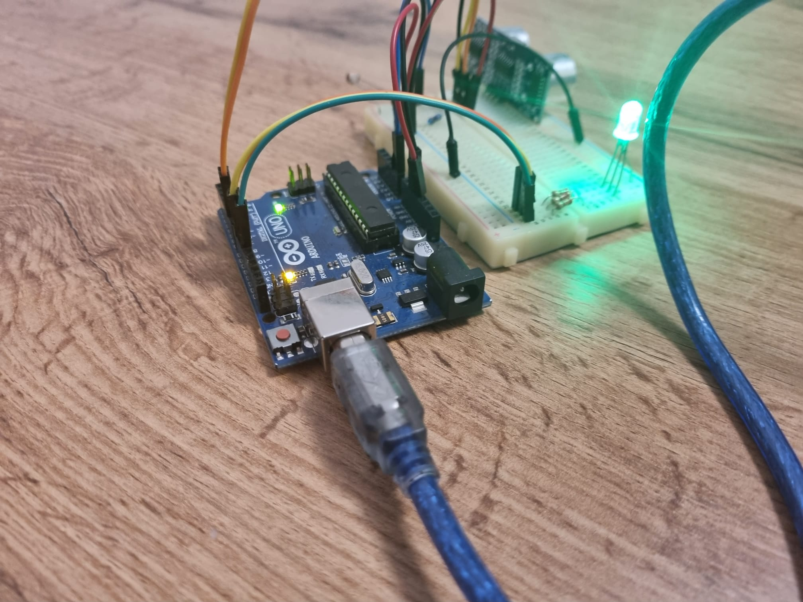

# RGB LED Controller

## Commponents
•RGB LED (At least 1)
•Potentiometers (At least 3)
•Resistors and wires as needed

## Tasks
### Technical Task
Use a separate potentiometer for controlling each color of the RGB LED:Red,Green, andBlue.  This control must leveragedigital electronics.  
Specifically,you  need  to  read  the  potentiometer’s  value  with  Arduino  and  then  write  amapped value to the LED pins. 
## Publishing Task
Add the code to the Git repository. 
Update the repository’s README with: 
Task Requirements and/or Description 
Photos of your setup 
A link to a video showcasing functionality (YouTube is recommended,but any accessible platform is acceptable).  Ensure the video is in thecorrect orientation. 

## Setup

## YouTube Link
  https://www.youtube.com/watch?v=XubC_vQ2RA8
